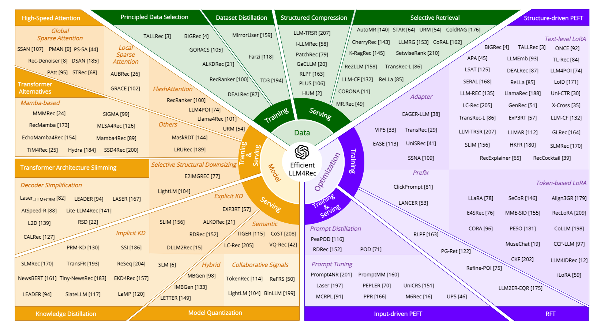

# Awesome-Efficient-LLM4Rec [](https://awesome.re)

<div align="center">

📚 A curated collection of papers and resources on **Efficient Large Language Models for Recommendation Systems**.

[](https://www.techrxiv.org/users/858346/articles/1242954-efficient-large-language-models-for-recommendation-a-survey)
[](https://opensource.org/licenses/MIT)
[](https://github.com/HaotianWu-LLM/Awesome-Efficient-LLM4Rec/pulls)
[](https://github.com/HaotianWu-LLM/Awesome-Efficient-LLM4Rec)

</div>

---

## 📖 About

This repository accompanies our survey paper:

> **Efficient Large Language Models for Recommendation: A Survey**  
> *Haotian Wu, Yingpeng Du, Tianjun Wei, Puay Siew Tan, Jie Zhang, Ong Yew Soon, Zhu Sun*  
> *TechRxiv*

We systematically review efficiency-oriented methods in LLM-based Recommender Systems (LLM4Rec), organizing the literature along two dimensions: the **RS pipeline** (data processing → model design → optimization strategy) and the **operational phase** (training → serving).

---

## 🗂️ Taxonomy Overview

<div align="center">

<p><i>Figure 1: Overview of the proposed two-dimensional taxonomy for efficient LLM4Rec methods.</i></p>
</div>

---

## 📋 Table of Contents

- [1. Data-level Methods](#1-data-level-methods)
  - [1.1 Efficient Data Compression for Training](#11-efficient-data-compression-for-training)
  - [1.2 Efficient Data Compression for Serving](#12-efficient-data-compression-for-serving)
- [2. Model-level Methods](#2-model-level-methods)
  - [2.1 High-speed Model Architecture](#21-high-speed-model-architecture)
  - [2.2 Lightweight Model Compression](#22-lightweight-model-compression)
- [3. Optimization-level Methods](#3-optimization-level-methods)
  - [3.1 Structure-driven PEFT (sPEFT)](#31-structure-driven-peft-speft)
  - [3.2 Input-driven PEFT (iPEFT)](#32-input-driven-peft-ipeft)
  - [3.3 Reinforcement Learning Fine-Tuning (RFT)](#33-reinforcement-learning-fine-tuning-rft)
- [4. Related Repositories](#5-related-repositories)
- [Contributing](#contributing)
- [Citation](#citation)

---

## 1. Data-level Methods

Data-level methods aim to improve efficiency by optimizing the scale and structure of training or inference data, rather than modifying model architectures or optimization strategies.

### 1.1 Efficient Data Compression for Training

<details open><summary><b>1.1.1 Principled Data Selection</b></summary>
<p>

Methods that identify and use a small subset of the most effective and representative samples for training.

| **Name** | **Paper** | **Publication** | **Paper Link** | **Code Link** |
|:---:|:---|:---:|:--------------:|:-------------:|
| BIGRec | A Bi-step Grounding Paradigm for Large Language Models in Recommendation Systems | TORS 2025 |  [[Paper]](https://dl.acm.org/doi/10.1145/3716393)  |  [[Code]](https://github.com/SAI990323/BIGRec)  |
| ALKDRec | Active Large Language Model-based Knowledge Distillation for Session-based Recommendation | AAAI 2025 |  [[Paper]](https://dl.acm.org/doi/10.1609/aaai.v39i11.33263)  |  [[Code]](https://github.com/kk97111/ALKDRec)  |
| RecRanker | RecRanker: Instruction Tuning Large Language Model as Ranker for Top-k Recommendation | TOIS 2025 |  [[Paper]](https://dl.acm.org/doi/10.1145/3705728)  |  [[Code]](https://github.com/sichunluo/RecRanker)  |
| GORACS | GORACS: Group-level Optimal Transport-guided Coreset Selection for LLM-based Recommender Systems | KDD 2025 |  [[Paper]](https://dl.acm.org/doi/10.1145/3711896.3736985)  |  [[Code]](https://github.com/Mithas-114/GORACS)  |
| DEALRec | Data-efficient Fine-tuning for LLM-based Recommendation | SIGIR 2024 |  [[Paper]](https://dl.acm.org/doi/10.1145/3626772.3657807)  |  [[Code]](https://github.com/Linxyhaha/DEALRec)  |
| TALLRec | TALLRec: An Effective and Efficient Tuning Framework to Align Large Language Model with Recommendation | RecSys 2023 |  [[Paper]](https://dl.acm.org/doi/10.1145/3604915.3608857)   |  [[Code]](https://github.com/SAI990323/TALLRec)   |


</p>
</details>

<details open><summary><b>1.1.2 Dataset Distillation</b></summary>
<p>

Methods that synthesize a small, information-rich dataset from large-scale recommendation data.

| **Name** | **Paper** | **Publication** | **Paper Link** | **Code Link** |
|:---:|:---|:---------------:|:---:|:-------------:|
| TD3 | TD3: Tucker Decomposition based Dataset Distillation Method for Sequential Recommendation |    WWW 2025     | [[Paper]](https://dl.acm.org/doi/10.1145/3696410.3714613) |  [[Code]](https://github.com/USTC-StarTeam/TD3)  |
| MirrorUser | Mirroring Users: Towards Building Preference-aligned User Simulator with User Feedback in Recommendation |   arXiv 2025    | [[Paper]](https://arxiv.org/abs/2508.18142) |  [[Code]](https://github.com/UserMirrorer/UserMirrorer)  |
| Farzi | Farzi Data: Autoregressive Data Distillation |   Arxiv 2023    | [[Paper]](https://arxiv.org/abs/2310.09983) |       /       |

</p>
</details>

### 1.2 Efficient Data Compression for Serving

<details open><summary><b>1.2.1 Selective Retrieval</b></summary>
<p>

**Retrieval for Contextual Evidence**

| **Name** | **Paper** | **Publication** | **Paper Link** |                   **Code Link**                   |
|:---:|:---|:---:|:---:|:-------------------------------------------------:|
| AutoMR | Leveraging Memory Retrieval to Enhance LLM-based Generative Recommendation | WWW 2025 | [[Paper]](https://dl.acm.org/doi/10.1145/3701716.3715596) |                         \                         |
| Re2LLM | Re2LLM: Reflective Reinforcement Large Language Model for Session-based Recommendation | AAAI 2025 | [[Paper]](https://dl.acm.org/doi/10.1609/aaai.v39i12.33399) |                         \                         |
| MR.Rec | MR.Rec: Synergizing Memory and Reasoning for Personalized Recommendation Assistant with LLMs | arXiv 2025 | [[Paper]](https://arxiv.org/abs/2510.14629) |                         \                         |
| LLM-CF | Large Language Models Enhanced Collaborative Filtering | CIKM 2024 | [[Paper]](http://dl.acm.org/doi/10.1145/3627673.3679558) |   [[Code]](https://github.com/Jeryi-Sun/LLM-CF)   |
| LLMRG | Enhancing Recommender Systems with Large Language Model Reasoning Graphs | AAAI 2024 | [[Paper]](https://dl.acm.org/doi/10.1609/aaai.v38i17.29887) |                         \                         |
| CoRAL | CoRAL: Collaborative Retrieval-Augmented Large Language Models Improve Long-tail Recommendation | KDD 2024 | [[Paper]](https://dl.acm.org/doi/10.1145/3637528.3671901) |                         \                         |
| ReLLa | ReLLa: Retrieval-enhanced Large Language Models for Lifelong Sequential Behavior Comprehension in Recommendation | WWW 2024 | [[Paper]](https://dl.acm.org/doi/abs/10.1145/3589334.3645467) | [[Code]](https://github.com/LaVieEnRose365/ReLLa) |


**Retrieval for Candidate Pruning**

| **Name** | **Paper** | **Publication** | **Paper Link** |                  **Code Link**                  |
|:---:|:---|:---:|:---:|:-----------------------------------------------:|
| URM | Large Language Model as Universal Retriever in Industrial-Scale Recommender System | arXiv 2025 | [[Paper]](https://arxiv.org/abs/2502.03041) |                        \                        |
| ColdRAG | Cold-Start Recommendation with Knowledge-Guided Retrieval-Augmented Generation | arXiv 2025 | [[Paper]](https://arxiv.org/html/2505.20773v2) |                        \                        |
| K-RagRec | Knowledge Graph Retrieval-Augmented Generation for LLM-based Recommendation | ACL 2025 | [[Paper]](https://arxiv.org/abs/2501.02226) | [[Code]](https://github.com/Sjay-Wang/K-ragrec) |
| CORONA | CORONA: A Coarse-to-Fine Framework for Graph-based Recommendation with Large Language Models | SIGIR 2025 | [[Paper]](https://dl.acm.org/doi/10.1145/3726302.3729937) |                   [[Code]](https://github.com/BUPT-GAMMA/CORONA)                   |
| TransRec-L | Bridging Items and Language: A Transition Paradigm for Large Language Model-based Recommendation | KDD 2024 | [[Paper]](https://dl.acm.org/doi/10.1145/3637528.3671884) |                   [[Code]](https://github.com/Linxyhaha/TransRec)                   |
| STAR | STAR: A Simple Training-free Approach for Recommendations using Large Language Models | arXiv 2024 | [[Paper]](https://arxiv.org/abs/2410.16458) |  [[Code]](https://github.com/jyouturner/STAR)   |
| CherryRec | CherryRec: Enhancing News Recommendation Quality via LLM-driven Framework | arXiv 2024 | [[Paper]](https://arxiv.org/abs/2406.12243) |                        \                        |
| SetwiseRank | A Setwise Approach for Effective and Highly Efficient Zero-shot Ranking with Large Language Models | SIGIR 2024 | [[Paper]](https://dl.acm.org/doi/10.1145/3626772.3657813) |                   [[Code]](https://github.com/ielab/llm-rankers)                   |


</p>
</details>

<details open><summary><b>1.2.2 Structured Compression</b></summary>
<p>

Methods that reduce lengthy structured or sequential inputs by extracting key information.

| **Name** | **Paper** | **Publication** | **Paper Link** | **Code Link** |
|:---:|:---|:---:|:---:|:-------------:|
| PatchRec | Multi-Grained Patch Training for Efficient LLM-based Recommendation | SIGIR 2025 | [[Paper]](https://dl.acm.org/doi/10.1145/3726302.3730042) |       \       |
| PLUS | Learning to Summarize User Information for Personalized Reinforcement Learning from Human Feedback | arXiv 2025 | [[Paper]](https://arxiv.org/abs/2507.13579) |       \       |
| RLPF | RLPF: Reinforcement Learning from Prediction Feedback for User Summarization with LLMs | AAAI 2025 | [[Paper]](https://arxiv.org/abs/2409.04421) |       \       |
| I-LLMRec | Image is All You Need: Towards Efficient and Effective Large Language Model-Based Recommender Systems | arXiv 2025 | [[Paper]](https://arxiv.org/abs/2503.06238) |       \       |
| HUM | Heterogeneous User Modeling for LLM-based Recommendation | RecSys 2025 | [[Paper]](https://dl.acm.org/doi/10.1145/3705328.3748085) |       \       |
| LLM-TRSR | Harnessing Large Language Models for Text-Rich Sequential Recommendation | WWW 2024 | [[Paper]](https://arxiv.org/abs/2403.13325) |       \       |
| GaCLLM | Large Language Model with Graph Convolution for Recommendation | arXiv 2024 | [[Paper]](https://arxiv.org/abs/2402.08859) |       \       |


</p>
</details>

---

## 2. Model-level Methods

Model-level methods focus on architectural innovations and compression techniques to reduce computational and storage complexity.

### 2.1 High-speed Model Architecture

<details open><summary><b>2.1.1 High-speed Attention</b></summary>
<p>

**Sparse Attention (Local)**

| **Name** | **Paper** | **Publication** | **Paper Link** | **Code Link** |
|:---:|:---|:---:|:---:|:-------------:|
| GRACE | GRACE: Generative Recommendation via Journey-Aware Sparse Attention on Chain-of-Thought Tokenization | RecSys 2025 | [[Paper]](https://dl.acm.org/doi/10.1145/3705328.3748056) |       \       |
| AUBRec | AUBRec: Adaptive Augmented Self-Attention via User Behaviors for Sequential Recommendation | Neural Computing and Applications 2022 | [[Paper]](https://link.springer.com/article/10.1007/s00521-022-07623-5) |       \       |


**Sparse Attention (Global)**

| **Name** | **Paper** |    **Publication**    | **Paper Link** |                 **Code Link**                 |
|:---:|:---|:---------------------:|:---:|:---------------------------------------------:|
| PAtt | Probabilistic Attention for Sequential Recommendation |       KDD 2024        | [[Paper]](https://dl.acm.org/doi/10.1145/3637528.3671733) |                       \                       |
| SPAR | SPAR: Personalized Content-based Recommendation via Long Engagement Attention |      arXiv 2024       | [[Paper]](https://arxiv.org/abs/2402.10555) |                       \                       |
| PMAN | Probabilistic Masked Attention Networks for Explainable Sequential Recommendation |      IJCAI 2023       | [[Paper]](https://www.ijcai.org/proceedings/2023/230) |                       \                       |
| STRec | STRec: Sparse Transformer for Sequential Recommendations |      RecSys 2023      | [[Paper]](https://dl.acm.org/doi/10.1145/3604915.3608779) | [[Code]](https://github.com/ChengxiLi5/STRec) |
| PS-SA | PS-SA: An Efficient Self-Attention via Progressive Sampling for User Behavior Sequence Modeling |       CIKM 2023       | [[Paper]](https://dl.acm.org/doi/10.1145/3583780.3615495) |                       \                       |
| SSAN | Social-aware Sparse Attention Network for Session-based Social Recommendation | EMNLP (Findings) 2022 | [[Paper]](https://aclanthology.org/2022.findings-emnlp.159/) |                       \                       |
| Rec-Denoiser | Denoising Self-Attentive Sequential Recommendation |      RecSys 2022      | [[Paper]](https://dl.acm.org/doi/10.1145/3523227.3546788) |                       \                       |
| DSAN | Dual Sparse Attention Network for Session-based Recommendation |       AAAI 2021       | [[Paper]](https://ojs.aaai.org/index.php/AAAI/article/view/16593) |                       \                       |


**FlashAttention**

| **Name** | **Paper** | **Publication** | **Paper Link** |                  **Code Link**                   |
|:---:|:---|:---:|:---:|:------------------------------------------------:|
| RecRanker | RecRanker: Instruction Tuning Large Language Model as Ranker for Top-k Recommendation | TOIS 2025 | [[Paper]](https://dl.acm.org/doi/10.1145/3705728) | [[Code]](https://github.com/sichunluo/RecRanker) |
| URM | Large Language Model as Universal Retriever in Industrial-Scale Recommender System | arXiv 2025 | [[Paper]](https://arxiv.org/abs/2502.03041) |                   [[Code]](#)                    |
| LLM4POI | Large Language Models for Next Point-of-Interest Recommendation | SIGIR 2024 | [[Paper]](https://dl.acm.org/doi/abs/10.1145/3626772.3657840) |  [[Code]](https://github.com/neolifer/LLM4POI)   |
| Llama4Rec | Integrating Large Language Models into Recommendation via Mutual Augmentation and Adaptive Aggregation | arXiv 2024 | [[Paper]](https://arxiv.org/abs/2401.13870) |                        \                         |


</p>
</details>

<details open><summary><b>2.1.2 Transformer Alternatives</b></summary>
<p>

**Mamba-based Methods**

| **Name** | **Paper** |   **Publication**   | **Paper Link** |                    **Code Link**                     |
|:---:|:---|:-------------------:|:---:|:----------------------------------------------------:|
| SIGMA | SIGMA: Selective Gated Mamba for Sequential Recommendation |      AAAI 2025      | [[Paper]](https://ojs.aaai.org/index.php/AAAI/article/view/33336) |      [[Code]](https://github.com/ziwliu8/SIGMA)      |
| Hydra | A Novel Mamba-based Sequential Recommendation Method |     arXiv 2025      | [[Paper]](https://arxiv.org/abs/2504.07398) |                          \                           |
| MMM4Rec | MMM4Rec: An Transfer-Efficient Framework for Multi-modal Sequential Recommendation |     arXiv 2025      | [[Paper]](https://arxiv.org/html/2506.02916v2) |                          \                           |
| SSD4Rec | SSD4Rec: A Structured State Space Duality Model for Efficient Sequential Recommendation |      TOIS 2025      | [[Paper]](https://dl.acm.org/doi/10.1145/3773038) | [[Code]](https://github.com/ZhangYifeng1995/SSD4Rec) |
| TiM4Rec | TiM4Rec: An Efficient Sequential Recommendation Model Based on Time-Aware Structured State Space Duality Model | Neurocomputing 2025 | [[Paper]](https://www.sciencedirect.com/science/article/abs/pii/S0925231225019423) |   [[Code]](https://github.com/alwaysfhao/tim4rec)    |
| MLSA4Rec | MLSA4Rec: Mamba Combined with Low-Rank Decomposed Self-Attention for Sequential Recommendation |     arXiv 2024      | [[Paper]](https://arxiv.org/abs/2407.13135) |                          \                           |
| Mamba4Rec | Mamba4Rec: Towards Efficient Sequential Recommendation with Selective State Space Models |     RelKD 2024      | [[Paper]](https://arxiv.org/abs/2403.03900) | [[Code]](https://github.com/chengkai-liu/Mamba4Rec)  |
| EchoMamba4Rec | EchoMamba4Rec: Harmonizing Bidirectional State Space Models with Spectral Filtering for Advanced Sequential Recommendation |     arXiv 2024      | [[Paper]](https://arxiv.org/abs/2406.02638) |                          \                           |
| RecMamba | Uncovering Selective State Space Model's Capabilities in Lifelong Sequential Recommendation |     arXiv 2024      | [[Paper]](https://arxiv.org/abs/2403.16371) |   [[Code]](https://github.com/nancheng58/RecMamba)   |


**Other Alternatives**

| **Name** | **Paper** | **Publication** | **Paper Link** |                **Code Link**                 |
|:---:|:---|:---:|:---:|:--------------------------------------------:|
| MaskRDT | Retentive Decision Transformer with Adaptive Masking for Reinforcement Learning-Based Recommendation Systems | TIST 2025 | [[Paper]](https://dl.acm.org/doi/10.1145/3719208) |                      \                       |
| LRURec | Linear Recurrent Units for Sequential Recommendation | WSDM 2024 | [[Paper]](https://dl.acm.org/doi/10.1145/3616855.3635760) | [[Code]](https://github.com/yueqirex/LRURec) |


</p>
</details>

<details open><summary><b>2.1.3 Transformer Architecture Slimming</b></summary>
<p>

**Decoder Simplification**

| **Name** | **Paper** |    **Publication**    | **Paper Link** |                      **Code Link**                      |
|:---:|:---|:---------------------:|:---:|:-------------------------------------------------------:|
| CALRec | Efficient Item ID Generation for Large-Scale LLM-based Recommendation |      arXiv 2025       | [[Paper]](https://arxiv.org/abs/2509.03746) |                            \                            |
| AtSpeed-R | Efficient Inference for Large Language Model-based Generative Recommendation |       ICLR 2025       | [[Paper]](https://arxiv.org/abs/2410.05165) |     [[Code]](https://github.com/Linxyhaha/AtSpeed)      |
| LASER | Efficiency Unleashed: Inference Acceleration for LLM-based Recommender Systems with Speculative Decoding |      SIGIR 2025       | [[Paper]](https://dl.acm.org/doi/10.1145/3726302.3729961) |                            \                            |
| L2D | Decoding in Latent Spaces for Efficient Inference in LLM-based Recommendation | EMNLP 2025 (Findings) | [[Paper]](https://aclanthology.org/2025.findings-emnlp.401.pdf) |                            \                            |
| RSD | Reinforcement Speculative Decoding for Fast Ranking |      arXiv 2025       | [[Paper]](https://arxiv.org/abs/2505.20316) |                            \                            |
| LEADER | Large Language Model Distilling Medication Recommendation Model |      arXiv 2025       | [[Paper]](https://arxiv.org/abs/2402.02803) | [[Code]](https://github.com/liuqidong07/LEADER-pytorch) |
| Laser_LLM+CRM | Large Language Models Make Sample-Efficient Recommender Systems |       FCS 2024        | [[Paper]](https://dl.acm.org/doi/10.1007/s11704-024-40039-z) |                            \                            |
| Lite-LLM4Rec | Rethinking Large Language Model Architectures for Sequential Recommendations |      arXiv 2024       | [[Paper]](https://arxiv.org/abs/2402.09543) |                            \                            |


**Selective Structural Downsizing**

| **Name** | **Paper** | **Publication** | **Paper Link** | **Code Link** |
|:---:|:---|:---:|:---:|:---:|
| E2IMGREC | Spectral and Geometric Spaces Representation Regularization for Multi-Modal Sequential Recommendation | CIKM 2024 | [[Paper]](https://dl.acm.org/doi/10.1145/3627673.3679647) | [[Code]](https://github.com/WHUIR/E2ImgRec) |
| LightLM | LightLM: A Lightweight Deep and Narrow Language Model for Generative Recommendation | arXiv 2023 | [[Paper]](https://arxiv.org/abs/2310.17488) | [[Code]](https://github.com/dongyuanjushi/LightLM) |

</p>
</details>

### 2.2 Lightweight Model Compression

<details open><summary><b>2.2.1 Knowledge Distillation</b></summary>
<p>

**Explicit Knowledge Distillation**

| **Name** | **Paper** | **Publication** | **Paper Link** |                 **Code Link**                  |
|:---:|:---|:---------------:|:---:|:----------------------------------------------:|
| EXP3RT | Review-driven Personalized Preference Reasoning with Large Language Models for Recommendation |   SIGIR 2025    | [[Paper]](https://dl.acm.org/doi/10.1145/3726302.3730055) |                  [[Code]](https://github.com/jieyong99/exp3rt)                   |
| ALKDRec | Active Large Language Model-based Knowledge Distillation for Session-based Recommendation |    AAAI 2025    | [[Paper]](https://dl.acm.org/doi/10.1609/aaai.v39i11.33263) |  [[Code]](https://github.com/kk97111/ALKDRec)  |
| DLLM2Rec | Distillation Matters: Empowering Sequential Recommenders to Match the Performance of Large Language Models |   RecSys 2024   | [[Paper]](https://dl.acm.org/doi/10.1145/3640457.3688118) | [[Code]](https://github.com/istarryn/dllm2rec) |
| RDRec | RDRec: Rationale Distillation for LLM-based Recommendation |    ACL 2024     | [[Paper]](https://aclanthology.org/2024.acl-short.6/) |  [[Code]](https://github.com/WangXFng/RDRec)   |
| SLIM | Can Small Language Models be Good Reasoners for Sequential Recommendation? |    WWW 2024     | [[Paper]](https://dl.acm.org/doi/10.1145/3589334.3645671) |                       \                        |

**Implicit Knowledge Distillation**

| **Name** | **Paper** |    **Publication**    | **Paper Link** |                      **Code Link**                      |
|:---:|:---|:---------------------:|:---:|:-------------------------------------------------------:|
| SLM | Scaling Down, Serving Fast: Compressing and Deploying Efficient LLMs for Recommendation Systems |      EMNLP 2025       | [[Paper]](https://aclanthology.org/2025.emnlp-industry.119/) |                            \                            |
| EKD4Rec | EKD4Rec: Ensemble Knowledge Distillation from LLM-based Models to Traditional Sequential Recommenders |       WWW 2025        | [[Paper]](https://dl.acm.org/doi/10.1145/3701716.3715527) |                            \                            |
| SlateLLM | SlateLLM: Distilling LLM Semantics into Session-Aware Slate Recommendation without Inference Overhead |      RecSys 2025      | [[Paper]](https://dl.acm.org/doi/10.1145/3705328.3759306) |                            \                            |
| SLMRec | SLMRec: Distilling Large Language Models into Small for Sequential Recommendation |       ICLR 2025       | [[Paper]](https://arxiv.org/abs/2405.17890) |      [[Code]](https://github.com/WujiangXu/SLMRec)      |
| PRM-KD | Distillation is All You Need for Practically Using Different Pre-trained Recommendation Models |      arXiv 2024       | [[Paper]](https://arxiv.org/html/2401.00797v1) |                            \                            |
| TransFR | TransFR: Transferable Federated Recommendation with Pre-trained Language Models |      arXiv 2024       | [[Paper]](https://arxiv.org/abs/2402.01124) |                            \                            |
| LaMP | Optimization Methods for Personalizing Large Language Models through Retrieval Augmentation |      SIGIR 2024       | [[Paper]](https://dl.acm.org/doi/10.1145/3626772.3657783) |                            \                            |
| LEADER | Large Language Model Distilling Medication Recommendation Model |      arXiv 2024       | [[Paper]](https://arxiv.org/abs/2402.02803) | [[Code]](https://github.com/liuqidong07/LEADER-pytorch) |
| ReSeq | Reciprocal Sequential Recommendation |      RecSys 2023      | [[Paper]](https://dl.acm.org/doi/10.1145/3604915.3608798) |     [[Code]](https://github.com/zhengbw0324/ReSeq)      |
| Tiny-NewsRec | Tiny-NewsRec: Effective and Efficient PLM-based News Recommendation |      EMNLP 2022       | [[Paper]](https://arxiv.org/abs/2112.00944) |   [[Code]](https://github.com/yflyl613/Tiny-NewsRec)    |
| NewsBERT | NewsBERT: Distilling Pre-trained Language Model for Intelligent News Application | EMNLP 2021 (Findings) | [[Paper]](https://aclanthology.org/2021.findings-emnlp.280/) |                            \                            |
| SSI | Improving Sequential Recommendation Consistency with Self-Supervised Imitation |      IJCAI 2021       | [[Paper]](https://arxiv.org/abs/2106.14031) |                            \                            |

</p>
</details>

<details open><summary><b>2.2.2 Model Quantization</b></summary>
<p>

**Quantization Based on Semantic Content**

| **Name** | **Paper** | **Publication** | **Paper Link** |                        **Code Link**                         |
|:---:|:---|:---:|:---:|:------------------------------------------------------------:|
| TIGER | Recommender Systems with Generative Retrieval | NeurIPS 2024 | [[Paper]](https://arxiv.org/abs/2305.05065) | [[Code]](https://github.com/EdoardoBotta/RQ-VAE-Recommender) |
| LC-Rec | Adapting Large Language Models by Integrating Collaborative Semantics for Recommendation | ICDE 2024 | [[Paper]](https://ieeexplore.ieee.org/document/10597986#) |         [[Code]](https://github.com/RUCAIBox/LC-Rec)         |
| CoST | CoST: Contrastive Quantization based Semantic Tokenization for Generative Recommendation | RecSys 2024 | [[Paper]](https://dl.acm.org/doi/fullHtml/10.1145/3640457.3688178) |                              \                               |
| VQ-Rec | Learning Vector-Quantized Item Representation for Transferable Sequential Recommenders | WWW 2023 | [[Paper]](https://dl.acm.org/doi/10.1145/3543507.3583434) |                         [[Code]](https://github.com/RUCAIBox/VQ-Rec)                          |

**Quantization Based on Collaborative Signals**

| **Name** | **Paper** | **Publication** | **Paper Link** |                   **Code Link**                    |
|:---:|:---|:---------------:|:---:|:--------------------------------------------------:|
| TokenRec | TokenRec: Learning to Tokenize ID for LLM-based Generative Recommendation |    TKDE 2025    | [[Paper]](https://ieeexplore.ieee.org/document/11129873) |  [[Code]](https://github.com/Quhaoh233/TokenRec)   |
| BinLLM | Text-like Encoding of Collaborative Information in Large Language Models for Recommendation |    ACL 2024     | [[Paper]](https://aclanthology.org/2024.acl-long.497/) |                         \                          |
| ReFRS | ReFRS: Resource-Efficient Federated Recommender System for Dynamic and Diversified User Preferences |   arXiv 2023    | [[Paper]](https://dl.acm.org/doi/10.1145/3560486) |                    [[Code]](#)                     |
| LightLM | LightLM: A Lightweight Deep and Narrow Language Model for Generative Recommendation |   arXiv 2023    | [[Paper]](https://arxiv.org/abs/2310.17488) | [[Code]](https://github.com/dongyuanjushi/LightLM) |


**Hybrid Quantization Strategies**

| **Name** | **Paper** | **Publication** | **Paper Link** | **Code Link** |
|:---:|:---|:---:|:---:|:---:|
| IMBGen | Implicit Multi-Behavior Generative Recommendation with Mixture of Quantization | TKDE 2025 | [[Paper]](https://ieeexplore.ieee.org/document/11007466/) | [[Code]](https://github.com/anananan116/MBGen) |
| LETTER | Learnable Item Tokenization for Generative Recommendation | CIKM 2024 | [[Paper]](#) | [[Code]](https://github.com/HonghuiBao2000/LETTER) |
| MBGen | Multi-behavior Generative Recommendation | CIKM 2024 | [[Paper]](https://dl.acm.org/doi/10.1145/3627673.3679730) | [[Code]](https://github.com/anananan116/MBGen) |

</p>
</details>

---

## 3. Optimization-level Methods

Optimization-level methods efficiently adapt a frozen LLM by adjusting only a small set of lightweight parameters.

### 3.1 Structure-driven PEFT (sPEFT)

<details open><summary><b>3.1.1 Adapter Tuning</b></summary>
<p>

| **Name** | **Paper** |    **Publication**    | **Paper Link** |                               **Code Link**                                |
|:---:|:---|:---------------------:|:---:|:--------------------------------------------------------------------------:|
| EAGER-LLM | EAGER-LLM: Enhancing Large Language Models as Recommenders through Exogenous Behavior-Semantic Integration |       WWW 2025        | [[Paper]](https://dl.acm.org/doi/10.1145/3696410.3714933) |                                     \                                      |
| SSNA | Towards Efficient and Effective Adaptation of Large Language Models for Sequential Recommendation |       FCS 2024        | [[Paper]](https://dl.acm.org/doi/10.1007/s11704-024-40044-2) |                                     \                                      |
| TransRec | Exploring Adapter-based Transfer Learning for Recommender Systems: Empirical Studies and Practical Insights |       WSDM 2024       | [[Paper]](https://dl.acm.org/doi/10.1145/3616855.3635805) | [[Code]](https://github.com/westlake-repl/Adapter4Rec/blob/main/README.md) |
| EASE | EASE: Learning Lightweight Semantic Feature Adapters from Large Language Models for CTR Prediction |       CIKM 2024       | [[Paper]](https://dl.acm.org/doi/10.1145/3627673.3680048) |                                     \                                      |
| VIP5 | VIP5: Towards Multimodal Foundation Models for Recommendation | EMNLP 2023 (Findings) | [[Paper]](https://aclanthology.org/anthology-files/anthology-files/pdf/findings/2023.findings-emnlp.644.pdf) |                                     \                                      |
| UniSRec | Towards Universal Sequence Representation Learning for Recommender Systems |       KDD 2022        | [[Paper]](https://dl.acm.org/doi/10.1145/3534678.3539381) |               [[Code]](https://github.com/RUCAIBox/UniSRec)                |


</p>
</details>

<details open><summary><b>3.1.2 Low-Rank Adaptation (LoRA) Tuning</b></summary>
<p>

**Text-level LoRA**

| **Name** | **Paper**                                                                                                        | **Publication** | **Paper Link** |                   **Code Link**                    |
|:---:|:-----------------------------------------------------------------------------------------------------------------|:---------------:|:---:|:--------------------------------------------------:|
| RecCocktail | RecCocktail: A Generalizable and Efficient Framework for LLM-Based Recommendation                                |    AAAI 2026    | [[Paper]](https://arxiv.org/abs/2502.08271) |                         \                          |
| BIGRec | A Bi-step Grounding Paradigm for Large Language Models in Recommendation Systems                                 |    TORS 2025    | [[Paper]](https://dl.acm.org/doi/10.1145/3716393) |   [[Code]](https://github.com/SAI990323/BIGRec)    |
| EXP3RT | Review-driven Personalized Preference Reasoning with Large Language Models for Recommendation                    |   SIGIR 2025    | [[Paper]](https://dl.acm.org/doi/10.1145/3726302.3730055) |   [[Code]](https://github.com/jieyong99/exp3rt)    |
| APA | Exact and Efficient Unlearning for Large Language Model-based Recommendation                                     |    TKDE 2025    | [[Paper]](https://ieeexplore.ieee.org/document/11112699) |                         \                          |
| SLMRec | SLMRec: Distilling Large Language Models into Small for Sequential Recommendation                                |    ICLR 2025    | [[Paper]](https://arxiv.org/abs/2405.17890) |   [[Code]](https://github.com/WujiangXu/SLMRec)    |
| SERAL | Bursting Filter Bubble: Enhancing Serendipity Recommendations with Aligned Large Language Models                 |    KDD 2025     | [[Paper]](https://dl.acm.org/doi/10.1145/3711896.3737199) |                         \                          |
| LLMEmb | LLMEmb: Large Language Model Can Be a Good Embedding Generator for Sequential Recommendation                     |    AAAI 2025    | [[Paper]](https://dl.acm.org/doi/abs/10.1609/aaai.v39i11.33327) |  [[Code]](https://github.com/liuqidong07/LLMEmb)   |
| LLM-REC | One Model for All: Large Language Models are Domain-Agnostic Recommendation Systems                              |    TOIS 2025    | [[Paper]](https://dl.acm.org/doi/10.1145/3705727) |                         \                          |
| LLMAR | Harnessing the Power of Large Language Model for Effective Web API Recommendation                                |    TII 2025     | [[Paper]](https://ieeexplore.ieee.org/document/10948476) |                         \                          |
| Uni-CTR | A Unified Framework for Multi-Domain CTR Prediction via Large Language Models                                    |    TOIS 2024    | [[Paper]](https://dl.acm.org/doi/10.1145/3698878) |  [[Code]](https://github.com/archersama/Uni-CTR)   |
| RecExplainer | RecExplainer: Aligning Large Language Models for Recommendation Model Interpretability                           |    KDD 2024     | [[Paper]](https://dl.acm.org/doi/10.1145/3637528.3671802) |                         \                          |
| GLRec | Exploring Large Language Model for Graph Data Understanding in Online Job Recommendations                        |    AAAI 2024    | [[Paper]](https://dl.acm.org/doi/10.1609/aaai.v38i8.28769) |      [[Code]](https://github.com/WLiK/GLRec)       |
| LC-Rec | Adapting Large Language Models by Integrating Collaborative Semantics for Recommendation                         |    ICDE 2024    | [[Paper]](https://ieeexplore.ieee.org/document/10597986/) |    [[Code]](https://github.com/RUCAIBox/LC-Rec)    |
| LSAT | Preliminary Study on Incremental Learning for Large Language Model-based Recommender Systems                     |    CIKM 2024    | [[Paper]](https://dl.acm.org/doi/10.1145/3627673.3679922) |                         \                          |
| TransRec-L | Bridging Items and Language: A Transition Paradigm for Large Language Model-based Recommendation                 |    KDD 2024     | [[Paper]](https://dl.acm.org/doi/10.1145/3637528.3671884) |                         \                          |
| GenRec | GenRec: Large Language Model for Generative Recommendation                                                       |    ECIR 2024    | [[Paper]](https://dl.acm.org/doi/10.1007/978-3-031-56063-7_42) | [[Code]](https://github.com/rutgerswiselab/GenRec) |
| LLM-CF | Large Language Models Enhanced Collaborative Filtering                                                           |    CIKM 2024    | [[Paper]](https://dl.acm.org/doi/10.1145/3627673.3679558) |   [[Code]](https://github.com/Jeryi-Sun/LLM-CF)    |
| DEALRec | Data-efficient Fine-tuning for LLM-based Recommendation                                                          |   SIGIR 2024    | [[Paper]](https://dl.acm.org/doi/10.1145/3626772.3657807) |   [[Code]](https://github.com/Linxyhaha/DEALRec)   |
| LLM-TRSR | Harnessing Large Language Models for Text-Rich Sequential Recommendation                                         |   Arxiv 2024    | [[Paper]](https://arxiv.org/abs/2403.13325) |                         \                          |
| SLIM | Can Small Language Models be Good Reasoners for Sequential Recommendation?                                       |    WWW 2024     | [[Paper]](https://dl.acm.org/doi/10.1145/3589334.3645671) |                         \                          |
| ONCE | ONCE: Boosting Content-based Recommendation with Both Open- and Closed-source Large Language Models              |    WSDM 2024    | [[Paper]](https://dl.acm.org/doi/10.1145/3616855.3635845) |      [[Code]](https://github.com/Jyonn/ONCE)       |
| ReLLa | ReLLa: Retrieval-enhanced Large Language Models for Lifelong Sequential Behavior Comprehension in Recommendation |    WWW 2024     | [[Paper]](https://dl.acm.org/doi/10.1145/3589334.3645467) | [[Code]](https://github.com/LaVieEnRose365/ReLLa)  |
| LoID | Enhancing Content-based Recommendation via Large Language Model                                                  |    CIKM 2024    | [[Paper]](https://dl.acm.org/doi/10.1145/3627673.3679913) |                         \                          |
| TL-Rec | TLRec: A Transfer Learning Framework to Enhance Large Language Models for Sequential Recommendation Tasks        |   RecSys 2024   | [[Paper]](https://dl.acm.org/doi/10.1145/3640457.3691710) |                         \                          |
| LLM4POI | Large Language Models for Next Point-of-Interest Recommendation                                                  |   SIGIR 2024    | [[Paper]](https://dl.acm.org/doi/abs/10.1145/3626772.3657840) |   [[Code]](https://github.com/neolifer/LLM4POI)    |
| TALLRec | TALLRec: An Effective and Efficient Tuning Framework to Align Large Language Model with Recommendation           |   RecSys 2023   | [[Paper]](https://dl.acm.org/doi/10.1145/3604915.3608857) |   [[Code]](https://github.com/SAI990323/TALLRec)   |
| HKFR | Heterogeneous Knowledge Fusion: A Novel Approach for Personalized Recommendation via LLM                         |   RecSys 2023   | [[Paper]](https://dl.acm.org/doi/10.1145/3604915.3608874) |                         \                          |
| LlamaRec | LlamaRec: Two-Stage Recommendation using Large Language Models for Ranking                                       | PGAI@CIKM 2023  | [[Paper]](https://arxiv.org/abs/2311.02089) |  [[Code]](https://github.com/Yueeeeeeee/LlamaRec)  |

**Token-level LoRA**

| **Name** | **Paper** | **Publication** | **Paper Link** |                          **Code Link**                           |
|:---:|:---|:---------------:|:---:|:----------------------------------------------------------------:|
| CoLLM | CoLLM: Integrating Collaborative Embeddings into Large Language Models for Recommendation |    TKDE 2025    | [[Paper]](https://ieeexplore.ieee.org/document/10882951) |           [[Code]](https://github.com/zyang1580/CoLLM)           |
| RecLoRA | Lifelong Personalized Low-Rank Adaptation of Large Language Models for Recommendation |   arXiv 2024    | [[Paper]](https://arxiv.org/abs/2408.03533) |                                \                                 |
| X-Cross | X-Cross: Dynamic Integration of Language Models for Cross-Domain Sequential Recommendation |   SIGIR 2025    | [[Paper]](https://dl.acm.org/doi/10.1145/3726302.3730117) |                                \                                 |
| CoRA | CoRA: Collaborative Information Perception by Large Language Model's Weights for Recommendation |    AAAI 2025    | [[Paper]](https://arxiv.org/abs/2408.10645) |         [[Code]](https://github.com/VanillaCreamer/CoRA)         |
| Align3GR | Align3GR: Unified Multi-Level Alignment for LLM-based Generative Recommendation |   arXiv 2025    | [[Paper]](https://arxiv.org/html/2511.11255v1) |                                \                                 |
| MME-SID | Empowering Large Language Model for Sequential Recommendation via Multimodal Embeddings and Semantic IDs |    CIKM 2025    | [[Paper]](https://dl.acm.org/doi/10.1145/3746252.3761169) |                                \                                 |
| LLM4IDRec | Enhancing ID-based Recommendation with Large Language Models |    TOIS 2025    | [[Paper]](https://dl.acm.org/doi/10.1145/3704263) |                                \                                 |
| PESO | Continual Low-Rank Adapters for LLM-based Generative Recommender Systems |   arXiv 2025    | [[Paper]](https://arxiv.org/abs/2510.25093) |                                \                                 |
| CKF | Collaborative Knowledge Fusion: A Novel Method for Multi-Task Recommender Systems via LLMs |    TKDE 2025    | [[Paper]](https://ieeexplore.ieee.org/document/11048506) |                                \                                 |
| SeCoR | SeCoR: Aligning Semantic and Collaborative Representations by Large Language Models for Next-Point-of-Interest Recommendations |   RecSys 2024   | [[Paper]](https://dl.acm.org/doi/10.1145/3640457.3688124) |            [[Code]](https://github.com/siri-ya/SeCor)            |
| iLoRA | Customizing Language Models with Instance-wise LoRA for Sequential Recommendation |  NeurIPS 2024   | [[Paper]](https://dl.acm.org/doi/10.5555/3737916.3741509) |           [[Code]](https://github.com/AkaliKong/iLoRA)           |
| CCF-LLM | Collaborative Cross-modal Fusion with Large Language Model for Recommendation |    CIKM 2024    | [[Paper]](https://dl.acm.org/doi/10.1145/3627673.3679596) | [[Code]](https://github.com/mediumboat/CCF-LLM-Data-Description) |
| MuseChat | MuseChat: A Conversational Music Recommendation System for Videos |    CVPR 2024    | [[Paper]](https://arxiv.org/abs/2310.06282) |    [[Code]](https://github.com/Dongzhikang/MuseChat-dataset)     |
| LLaRA | LLaRA: Aligning Large Language Models with Sequential Recommenders |   SIGIR 2024    | [[Paper]](https://dl.acm.org/doi/10.1145/3626772.3657690) |                                \                                 |
| E4SRec | E4SRec: An Elegant Effective Efficient Extensible Solution of Large Language Models for Sequential Recommendation |   arXiv 2023    | [[Paper]](https://arxiv.org/abs/2312.02443) |                                \                                 |

</p>
</details>

<details open><summary><b>3.1.3 Prefix Tuning</b></summary>
<p>

| **Name** | **Paper** | **Publication** | **Paper Link** | **Code Link** |
|:---:|:---|:---------------:|:---:|:-------------:|
| LANCER | Reformulating Sequential Recommendation: Learning Dynamic User Interest with Content-enriched Language Modeling |   DASFAA 2024   | [[Paper]](https://dl.acm.org/doi/10.1007/978-981-97-5555-4_25) |       \       |
| ClickPrompt | ClickPrompt: CTR Models are Strong Prompt Generators for Adapting Language Models to CTR Prediction |    WWW 2024     | [[Paper]](https://dl.acm.org/doi/10.1145/3589334.3645396) |       \       |

</p>
</details>

### 3.2 Input-driven PEFT (iPEFT)

<details open><summary><b>3.2.1 Prompt Tuning</b></summary>
<p>

| **Name** | **Paper** | **Publication** | **Paper Link** |                  **Code Link**                   |
|:---:|:---|:---------------:|:---:|:------------------------------------------------:|
| Laser | Laser: Parameter-Efficient LLM Bi-Tuning for Sequential Recommendation with Collaborative Information |    ACL 2025     | [[Paper]](https://aclanthology.org/2025.acl-long.949.pdf) |                        \                         |
| PromptMM | PromptMM: Multi-Modal Knowledge Distillation for Recommendation with Prompt-Tuning |    WWW 2024     | [[Paper]](https://dl.acm.org/doi/10.1145/3589334.3645359) |   [[Code]](https://github.com/HKUDS/PromptMM)    |
| MCRPL | MCRPL: A Pretrain, Prompt, and Fine-tune Paradigm for Non-overlapping Many-to-one Cross-domain Recommendation |    TOIS 2024    | [[Paper]](https://dl.acm.org/doi/10.1145/3641860) |                        \                         |
| PPR | Personalized Prompt for Sequential Recommendation |    TKDE 2024    | [[Paper]](https://dl.acm.org/doi/abs/10.1109/TKDE.2024.3357498) |                        \                         |
| UP5 | UP5: Unbiased Foundation Model for Fairness-Aware Recommendation |    EACL 2024    | [[Paper]](https://aclanthology.org/2024.eacl-long.114.pdf) |   [[Code]](https://github.com/agiresearch/UP5)   |
| Prompt4NR | Prompt Learning for News Recommendation |   SIGIR 2023    | [[Paper]](https://dl.acm.org/doi/10.1145/3539618.3591752) | [[Code]](https://github.com/resistzzz/Prompt4NR) |
| PEPLER | Personalized Prompt Learning for Explainable Recommendation |    TOIS 2023    | [[Paper]](https://dl.acm.org/doi/10.1145/3580488) | [[Code]](https://github.com/lileipisces/PEPLER)  |
| UniCRS | Towards Unified Conversational Recommender Systems via Knowledge-Enhanced Prompt Learning |    KDD 2022     | [[Paper]](https://arxiv.org/abs/2206.09363) |   [[Code]](https://github.com/RUCAIBox/UniCRS)   |
| M6Rec | M6-Rec: Generative Pretrained Language Models are Open-Ended Recommender Systems |   arXiv 2022    | [[Paper]](https://arxiv.org/abs/2205.08084) |                        \                         |


</p>
</details>

<details open><summary><b>3.2.2 Prompt Distillation</b></summary>
<p>

| **Name** | **Paper** | **Publication** | **Paper Link** |                **Code Link**                 |
|:---:|:---|:---:|:---:|:--------------------------------------------:|
| PeaPOD | Preference Distillation for Personalized Generative Recommendation | arXiv 2024 | [[Paper]](https://arxiv.org/abs/2407.05033) |                      \                       |
| RDRec | RDRec: Rationale Distillation for LLM-based Recommendation | ACL 2024 | [[Paper]](https://aclanthology.org/2024.acl-short.6/) |                 [[Code]](https://github.com/WangXFng/RDRec)                  |
| POD | Prompt Distillation for Efficient LLM-based Recommendation | CIKM 2023 | [[Paper]](https://dl.acm.org/doi/10.1145/3583780.3615017) | [[Code]](https://github.com/lileipisces/POD) |


</p>
</details>

### 3.3 Reinforcement Learning Fine-Tuning (RFT)

<details open><summary><b>RFT Methods</b></summary>
<p>

| **Name** | **Paper** | **Publication** | **Paper Link** |                   **Code Link**                   |
|:---:|:---|:---:|:---:|:-------------------------------------------------:|
| RLPF | RLPF: Reinforcement Learning from Prediction Feedback for User Summarization with LLMs | AAAI 2025 | [[Paper]](https://arxiv.org/abs/2409.04421) |                         \                         |
| Refine-POI | Refine-POI: Reinforcement Fine-Tuned Large Language Models for Next Point-of-Interest Recommendation | arXiv 2025 | [[Paper]](https://arxiv.org/abs/2506.21599) |                         \                         |
| LLM2ER-EQR | Fine-tuning Large Language Model based Explainable Recommendation with Explainable Quality Reward | AAAI 2024 | [[Paper]](https://ojs.aaai.org/index.php/AAAI/article/view/28777) | [[Code]](https://github.com/Yangmy412/LLM2ER-EQR) |
| PG-Ret | Optimizing Novelty of Top-k Recommendations using Large Language Models and Reinforcement Learning | KDD 2024 | [[Paper]](https://arxiv.org/abs/2406.14169) |                         \                         |

</p>
</details>

---

## 4. Related Repositories

| **Repository** | **Description** | **Maintainer** |
|:---:|:---|:---:|
| [Awesome-LLM-for-RecSys](https://github.com/CHIANGEL/Awesome-LLM-for-RecSys) | How Can Recommender Systems Benefit from LLMs | [CHIANGEL](https://github.com/CHIANGEL) |
| [LLM4Rec](https://github.com/WLiK/LLM4Rec) | LLM for Recommendation Papers | [WLiK](https://github.com/WLiK) |
| [Awesome-LLM4RS-Papers](https://github.com/nancheng58/Awesome-LLM4RS-Papers) | LLM4RS Paper Collection | [nancheng58](https://github.com/nancheng58) |
| [LLM4IR-Survey](https://github.com/RUC-NLPIR/LLM4IR-Survey) | LLM for Information Retrieval | [RUC-NLPIR](https://github.com/RUC-NLPIR) |
| [Efficient-LLMs-Survey](https://github.com/AIoT-MLSys-Lab/Efficient-LLMs-Survey) | Efficient LLMs Survey | [AIoT-MLSys-Lab](https://github.com/AIoT-MLSys-Lab) |

---

## Contributing

👍 **Contributions are welcome!**

If you have found relevant resources, discovered errors, or want to add new papers, please feel free to:
- Open an [Issue](https://github.com/HaotianWu-LLM/Awesome-Efficient-LLM4Rec/issues)
- Submit a [Pull Request](https://github.com/HaotianWu-LLM/Awesome-Efficient-LLM4Rec/pulls)

**Contact**: wu.haotian [AT] ntu [DOT] edu [DOT] sg

---

## Citation

If you find this repository helpful, please cite our survey paper:

```bibtex
@article{wu2026efficient,
  title={Efficient Large Language Models for Recommendation: A Survey},
  author={Wu, Haotian and Du, Yingpeng and Wei, Tianjun and Tan, Puay Siew and Zhang, Jie and Ong, Yew Soon and Sun, Zhu},
  journal={Authorea Preprints},
  year={2026},
  publisher={Authorea}
}
```

---

<div align="center">

**⭐ If you find this repository useful, please consider giving it a star! ⭐**

</div>
